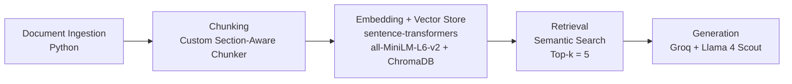

# Project 1 Planning: The Unofficial Guide

> Write this document before you write any pipeline code.
> Your spec and architecture diagram are what you'll use to direct AI tools (Claude, Copilot, etc.) to generate your implementation — the more specific they are, the more useful the generated code will be.
> Update the Retrieval Approach and Chunking Strategy sections if you change your approach during implementation.
> Update this file before starting any stretch features.

---

## Domain

<!-- What domain did you choose? Why is this knowledge valuable and hard to find through official channels? -->

My project is a retrieval-augmented grocery shopping assistant that helps users find useful information about major grocery retailers across New York, Maryland, and North Carolina. The knowledge base focuses on store locations, grocery offerings, shopping services, pickup and delivery options, membership requirements, and other retailer-specific information that can help someone decide where and how to shop.

I chose this domain because it connects directly to my Smart Pantry concept, which helps people manage the food they have at home and make better grocery-shopping decisions. Grocery information is scattered across individual retailer websites, store locators, FAQs, online-ordering pages, and service pages, making it difficult to compare stores in one place. The first version will focus on relatively stable retailer information rather than live prices, promotions, or inventory, which could be handled through retailer APIs or other live data sources in a future version.

---

## Documents

<!-- List your specific sources: URLs, subreddit names, forum threads, or file descriptions.
     Aim for at least 10 sources that together cover different subtopics or perspectives within your domain. -->

| # | Source | Description | URL |
|---|--------|-------------|-----|
| 1 | Walmart Pickup & Delivery | Information about Walmart grocery pickup and delivery services. | https://www.walmart.com/help/article/pickup-and-delivery/d0d02a5f54e54592930f110aaf6a2f50 |
| 2 | Walmart Store Finder | Store locations and available store services. | https://www.walmart.com/store-finder |
| 3 | Costco Warehouse Locations | Costco warehouse locations and store information. | https://www.costco.com/w/-/locations |
| 4 | Costco Same-Day Grocery Delivery | Same-day grocery delivery information, including delivery requirements and pricing considerations. | https://www.costco.com/f/-/same-day |
| 5 | BJ's Club Locator | BJ's locations, including locations in Maryland, New York, and North Carolina. | https://www.bjs.com/allClubLocator |
| 6 | BJ's Same-Day Delivery | Grocery delivery categories, eligibility, fees, and ordering information. | https://www.bjs.com/about/ordering/same-day-delivery/ |
| 7 | Trader Joe's Store Directory | Trader Joe's store locations by state. | https://locations.traderjoes.com/ |
| 8 | Trader Joe's Pantry Products | Pantry-related product categories and grocery information. | https://www.traderjoes.com/home/products/category/for-the-pantry-137 |
| 9 | Wegmans Store Locator | Wegmans store locations, including locations in NY, MD, and NC. | https://www.wegmans.com/stores |
| 10 | Wegmans Grocery Delivery & Pickup | Grocery pickup, delivery, ordering, fees, and payment information. | https://www.wegmans.com/grocery-delivery-pickup |
| 11 | Food Lion Maryland Locations | Food Lion locations throughout Maryland. | https://stores.foodlion.com/md |
| 12 | Food Lion North Carolina Locations | Food Lion locations throughout North Carolina. | https://stores.foodlion.com/nc |
| 13 | Food Lion Pickup & Home Delivery | Food Lion pickup and home delivery expansion across the Carolinas. | https://newsroom.foodlion.com/news-releases/news-release-details/food-lion-expands-pickup-and-home-delivery-across-carolinas/ |
| 14 | Giant Food Store Locator | Giant Food store locations and available services. | https://stores.giantfood.com/index.html |
| 15 | Giant Food Grocery Services | Giant Food store locations and available services. | https://giantfood.com/our_stores/locator/store_search.htm |
| 16 | ALDI Grocery Pickup | ALDI curbside grocery pickup and ordering information. | https://www.aldi.us/store/aldi/pages/grocery-pickup |
| 17 | ALDI Grocery Delivery | ALDI same-day grocery delivery and ordering information. | https://www.aldi.us/store/aldi/pages/grocery-delivery |
| 18 | Whole Foods Store Locator | Whole Foods Market store locations and store information. | https://www.wholefoodsmarket.com/stores |
| 19 | Whole Foods Online Ordering | Whole Foods Market online grocery ordering and available fulfillment options. | https://www.wholefoodsmarket.com/online-ordering |
| 20 | Target Pickup & Delivery | Target Order Pickup, Drive Up, same-day delivery, and grocery services. | https://corporate.target.com/about/products-services/pickup-delivery |
| 21 | Target Drive Up & Order Pickup | Details about Target Drive Up and Order Pickup services. | https://www.target.com/help/articles/delivery-options/drive-up-order-pickup |

---

## Chunking Strategy

<!-- How will you split documents into chunks?
     State your chunk size (in tokens or characters), overlap size, and explain why those
     numbers fit the structure of your documents.
     A review-heavy corpus warrants different chunking than a long FAQ. -->

**Chunk size:** Approximately 200 tokens per chunk.

**Overlap:** Approximately 30-40 tokens between chunks.

**Reasoning:** The documents are short, structured retailer profiles with clear sections such as store locations, grocery services, pickup, delivery, and membership. I will use section-aware chunking so related information stays together and important facts are less likely to be split across chunks. A target of approximately 200 tokens provides enough context for retrieval while keeping chunks focused, and a 30-40-token overlap helps preserve context when information crosses chunk boundaries without creating excessive duplication.

---

## Retrieval Approach

<!-- Which embedding model are you using (e.g., all-MiniLM-L6-v2 via sentence-transformers)?
     How many chunks will you retrieve per query (top-k)?
     If you were deploying this for real users and cost wasn't a constraint, what tradeoffs
     would you weigh in choosing a different embedding model — context length, multilingual
     support, accuracy on domain-specific text, latency? -->

**Embedding model:** `all-MiniLM-L6-v2` via `sentence-transformers`
I chose this model because it is lightweight, fast, and appropriate for the small English-language retailer knowledge base used in this project.

**Top-k:** 5
The system will initially retrieve the five most relevant chunks for each query. This provides enough context for questions that may require information from multiple sections or retailer sources while limiting the amount of irrelevant information passed to the language model.

**Production tradeoff reflection:**
I would compare `all-MiniLM-L6-v2` with larger or more retrieval-focused embedding models. A stronger model could improve semantic retrieval accuracy, especially for more complex grocery-shopping questions, but it could require more memory, processing time, and computational resources. I would also consider factors such as domain-specific vocabulary, multilingual support, context length, retrieval accuracy, latency, and operating cost. For this V1, the smaller model provides a practical balance between retrieval quality and performance.

---

## Evaluation Plan

<!-- List your 5 test questions with their expected correct answers.
     Questions should be specific enough that you can judge whether the system's response
     is right or wrong. "What are good dining halls?" is too vague.
     "What do students say about wait times at [dining hall name] during lunch?" is testable. -->

| # | Question | Expected answer |
| 1 | Which of the 10 retailers offer grocery pickup, and which offer grocery delivery? | Based on the knowledge base, Walmart, BJ's Wholesale Club, Wegmans, Food Lion, Giant Food, ALDI, Whole Foods Market, and Target have documented pickup and/or delivery services. Costco has documented grocery delivery but not a general grocery pickup service in the sources used. Trader Joe's does not have pickup or delivery services established by the sources used. |

| 2 | Which of the 10 retailers have locations in North Carolina? | The knowledge base should identify retailers with source material confirming North Carolina locations. Confirmed retailers include Walmart, Costco, BJ's Wholesale Club, Trader Joe's, Wegmans, Food Lion, ALDI, Whole Foods Market, and Target. Giant Food's provided sources do not establish North Carolina locations. |

| 3 | Which retailers in the knowledge base use a membership-based shopping model? | Costco and BJ's Wholesale Club are the membership-based retailers in the knowledge base. |

| 4 | What grocery pickup and delivery options does Wegmans offer? | Wegmans offers online grocery ordering with pickup at participating locations and grocery delivery to eligible customer addresses. Availability depends on location and service eligibility. |

| 5 | What is the current price of chicken breast at Walmart? | The system should explain that it does not have enough information to answer because the V1 knowledge base does not contain live product pricing. |

---

## Anticipated Challenges

<!-- What could go wrong? Name at least two specific risks with reasoning.
     Consider: noisy or inconsistent documents, missing source attribution, off-topic
     retrieval, chunks that split key information across boundaries. -->

1. **Retrieval may return the wrong retailer or service:** Because multiple retailer documents contain similar information about services such as pickup, delivery, locations, and membership, the system may retrieve chunks from the wrong retailer or fail to retrieve all relevant information for a comparison question. I will inspect retrieved chunks during testing and adjust the retrieval strategy if necessary.

2. **Location information may be difficult to retrieve consistently:** The retailer sources use different approaches to document store locations. Some provide state-specific location pages while others use broader store locators. This could make geographic questions such as identifying retailers with locations in North Carolina more difficult to retrieve accurately.

3. **Preventing unsupported answers:** The language model may attempt to answer questions when the retrieved context does not contain enough information. This is especially important for questions about current prices or inventory, which are outside the scope of the V1 knowledge base. The generation prompt will instruct the model to rely only on retrieved information and state when there is not enough information to answer.
---

## Architecture

<!-- Draw a diagram of your pipeline showing the five stages:
     Document Ingestion → Chunking → Embedding + Vector Store → Retrieval → Generation
     Label each stage with the tool or library you're using.
     You can use ASCII art, a Mermaid diagram, or embed a sketch as an image.
     You'll use this diagram as context when prompting AI tools to implement each stage. -->

The pipeline will ingest the retailer documents, divide them into section-aware chunks, generate embeddings for each chunk, and store the embeddings and source metadata in ChromaDB. When a user submits a question, the system will retrieve the five most relevant chunks and provide them as context to the Llama model through Groq for grounded response generation.

---

## AI Tool Plan

<!-- For each part of the pipeline below, describe:
     - Which AI tool you plan to use (Claude, Copilot, ChatGPT, etc.)
     - What you'll give it as input (which sections of this planning.md, which requirements)
     - What you expect it to produce
     - How you'll verify the output matches your spec

     "I'll use AI to help me code" is not a plan.
     "I'll give Claude my Chunking Strategy section and ask it to implement chunk_text()
     with my specified chunk size and overlap" is a plan. -->

**Milestone 3 — Ingestion and chunking:**
I will use ChatGPT to help implement the document ingestion and section-aware chunking pipeline based on the Domain, Documents, and Chunking Strategy sections of this plan. I will provide the required document structure, target chunk size, overlap, and project requirements and ask for help implementing and explaining the relevant Python functions. I will verify the output by inspecting cleaned documents, checking the number and contents of generated chunks, and manually reviewing representative chunks to make sure sections and important information are preserved.

**Milestone 4 — Embedding and retrieval:**
I will use ChatGPT to help implement the embedding and retrieval pipeline using `all-MiniLM-L6-v2`, `sentence-transformers`, and ChromaDB according to the Retrieval Approach and Architecture sections. I will provide the retrieval requirements and ask for help with embedding documents, storing source metadata, and creating a top-k semantic search function. I will verify the implementation by testing the five evaluation questions, inspecting the retrieved chunks and relevance scores, and making changes when the results do not match the planned behavior.

**Milestone 5 — Generation and interface:**
I will use ChatGPT to help connect the retrieval results to the required Llama 4 Scout model through Groq and build the basic Gradio interface. I will provide the Architecture, Retrieval Approach, and project requirements and ask for help creating a grounded generation prompt that requires the model to answer only from retrieved context and state when there is not enough information. I will verify the output using both supported and unsupported questions, checking source attribution and confirming that the model does not invent information outside the knowledge base.
